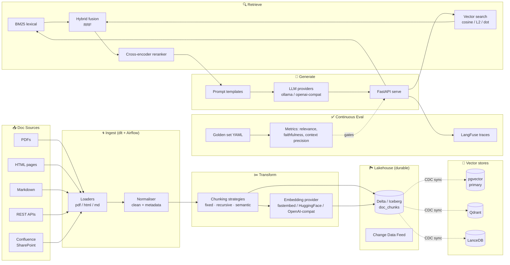

# rag-data-platform-vector-lakehouse

Production-grade **Retrieval-Augmented Generation (RAG) data platform** built for data engineers, not LLM prompt-tinkerers. Treats RAG as a data-engineering problem: durable chunked-and-embedded corpora in a **lakehouse** (Delta / Iceberg), synchronised into a **vector store** (pgvector, Qdrant, LanceDB), retrieved with **hybrid search + reranking**, and continuously **evaluated** with RAGAS-style metrics + a golden-set harness — all orchestrated by **Airflow** and zero-cost to run.


---

## Architecture



Full sequence diagrams in [`docs/architecture.md`](docs/architecture.md).

---

## Why this repo exists (and why it's different)

Most RAG repos are Jupyter-notebook toys. This one is built like a production data platform:

- **Corpus lives in a lakehouse.** `doc_chunks` is a Delta/Iceberg table with schema, partitions, time travel. Vector stores are **projections** that can be rebuilt.
- **Multi-strategy chunking + multi-backend vectors.** Swap `fixed` → `semantic` or `pgvector` → `Qdrant` without rewriting retrieval code.
- **Hybrid retrieval with reranking.** Vector-only search is yesterday's news; BM25+vector+cross-encoder reranking is the 2026 baseline.
- **Zero-cost CI.** Hash-based deterministic embeddings in CI; no API keys, no 1GB model downloads. Real providers (fastembed, HuggingFace, any OpenAI-wire-compatible endpoint) available behind a unified interface.
- **Continuous eval.** RAGAS-style metrics on a committed golden set + LangFuse tracing in local dev — you catch regressions before they ship.

---

## Tech highlights

| Layer | Tools |
|---|---|
| **Ingest** | `unstructured` (PDF/HTML), custom Markdown loader, `dlt` pipeline, Airflow DAGs |
| **Chunking** | Fixed, recursive (LangChain-style), semantic (embedding-sim breakpoints) — all pure Python, testable |
| **Embeddings** | `fastembed` (ONNX MiniLM, ~80 MB), HuggingFace `sentence-transformers`, OpenAI-compat HTTP adapter, Ollama local LLMs, **deterministic hash provider** for CI |
| **Vector stores** | **pgvector** (SQL-native), **Qdrant** (production), **LanceDB** (embedded), in-memory (tests) — behind one `VectorStore` interface |
| **Lakehouse** | Delta Lake + Apache Iceberg; `doc_chunks` partitioned by `source` + `ingested_date`; Change Data Feed drives vector-store sync |
| **Retrieval** | BM25 (rank_bm25) + vector + Reciprocal Rank Fusion + cross-encoder reranker |
| **Generation** | Provider-agnostic LLM interface; Ollama for local, any OpenAI-wire-compatible endpoint for cloud |
| **Serving** | FastAPI `/ask`, `/ingest`, `/eval` endpoints |
| **Orchestration** | Airflow DAGs for ingest + scheduled re-embed + nightly eval |
| **Observability** | LangFuse self-hosted docker; OpenLineage emitter hooks |
| **Eval** | RAGAS-style: context precision, answer relevance, faithfulness, ground-truth exact match, BLEU; golden set YAML |
| **IaC** | Terraform for RDS+pgvector, Qdrant ECS, secrets |
| **Languages** | Python, SQL (pgvector), Shell |
| **CI/CD** | GitHub Actions (lint + hermetic pytest: 30+ tests, no network) + Jenkinsfile + GitLab CI |

---

## Quickstart

```bash
make install             # python deps
make lint                # ruff + black + yamllint
make test                # pytest unit (hash embeddings, hermetic)
make compose-up          # postgres+pgvector + qdrant + langfuse + ollama
make seed                # ingest sample docs
make serve               # start FastAPI on :8000
make eval                # run golden-set eval
make airflow-up          # Airflow with ingest_docs DAG
```

---

## Project layout

```
rag-data-platform-vector-lakehouse/
├── .github/workflows/ci.yml
├── Makefile, Jenkinsfile, .gitlab-ci.yml, docker-compose.yml
├── docs/                         # architecture + eval methodology + lakehouse integration
├── src/
│   ├── rag/
│   │   ├── chunking/             # fixed / recursive / semantic
│   │   ├── embeddings/           # fastembed / hf / openai-compat / hash (CI)
│   │   ├── vector_stores/        # pgvector / qdrant / lance / inmemory
│   │   ├── loaders/              # pdf / html / markdown
│   │   ├── retrieval/            # retriever / reranker / hybrid RRF
│   │   ├── generation/           # llm providers / prompt templates
│   │   ├── eval/                 # metrics + golden set
│   │   └── api/                  # FastAPI server
│   ├── lakehouse/                # delta sink + CDC sync to vector stores
│   ├── dlt/                      # dlt ingestion pipeline
│   └── airflow/dags/             # ingest + reembed + eval DAGs
├── configs/                      # rag_config.yaml, golden_set.yaml
├── data/samples/                 # sample corpus
├── infra/terraform/              # RDS + pgvector + secrets
├── scripts/                      # bootstrap / seed / eval runners
└── tests/unit/                   # hermetic pytest suite
```

---

## License

MIT.
