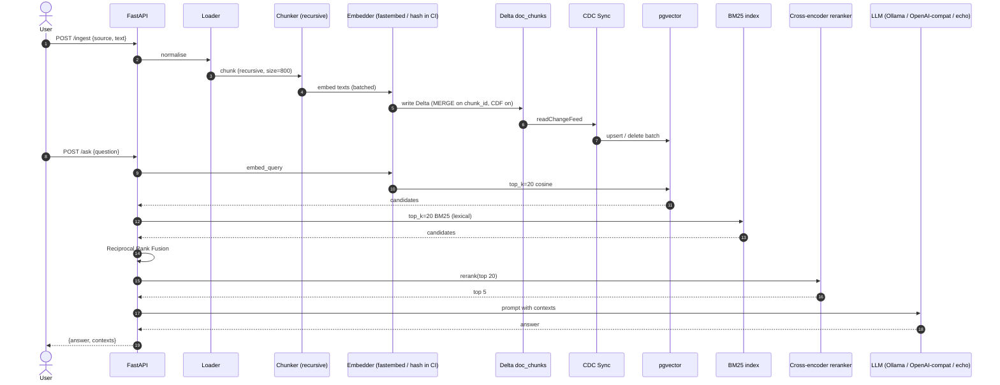
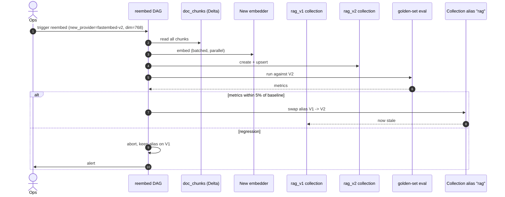
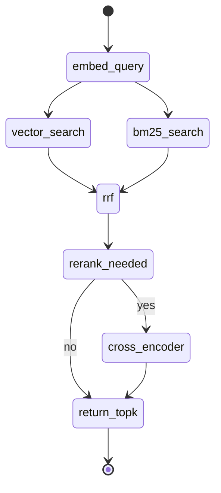
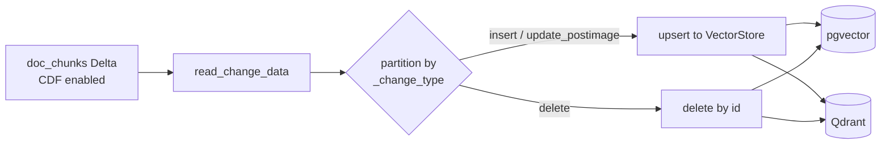

# Architecture — Sequence Diagrams

## 1. End-to-end ingest → ask

```mermaid
sequenceDiagram
    autonumber
    actor User
    participant API as FastAPI
    participant LD as Loader
    participant CK as Chunker (recursive)
    participant EM as Embedder (fastembed / hash in CI)
    participant DL as Delta doc_chunks
    participant SY as CDC Sync
    participant VS as pgvector
    participant BM as BM25 index
    participant RR as Cross-encoder reranker
    participant LLM as LLM (Ollama / OpenAI-compat / echo)

    User->>API: POST /ingest {source, text}
    API->>LD: normalise
    LD->>CK: chunk (recursive, size=800)
    CK->>EM: embed texts (batched)
    EM->>DL: write Delta (MERGE on chunk_id, CDF on)
    DL->>SY: readChangeFeed
    SY->>VS: upsert / delete batch
    User->>API: POST /ask {question}
    API->>EM: embed_query
    EM->>VS: top_k=20 cosine
    VS-->>API: candidates
    API->>BM: top_k=20 BM25 (lexical)
    BM-->>API: candidates
    API->>API: Reciprocal Rank Fusion
    API->>RR: rerank(top 20)
    RR-->>API: top 5
    API->>LLM: prompt with contexts
    LLM-->>API: answer
    API-->>User: {answer, contexts}
```

## 2. Re-embedding workflow

```mermaid
sequenceDiagram
    autonumber
    actor Ops
    participant DAG as reembed DAG
    participant DL as doc_chunks (Delta)
    participant EM as New embedder
    participant V1 as rag_v1 collection
    participant V2 as rag_v2 collection
    participant EV as golden-set eval
    participant AL as Collection alias "rag"

    Ops->>DAG: trigger reembed (new_provider=fastembed-v2, dim=768)
    DAG->>DL: read all chunks
    DAG->>EM: embed (batched, parallel)
    DAG->>V2: create + upsert
    DAG->>EV: run against V2
    EV-->>DAG: metrics
    alt metrics within 5% of baseline
        DAG->>AL: swap alias V1 -> V2
        AL-->>V1: now stale
    else regression
        DAG->>DAG: abort, keep alias on V1
        DAG->>Ops: alert
    end
```

## 3. Hybrid retrieval state

```mermaid
stateDiagram-v2
    [*] --> embed_query
    embed_query --> vector_search
    embed_query --> bm25_search
    vector_search --> rrf
    bm25_search --> rrf
    rrf --> rerank_needed
    rerank_needed --> cross_encoder: yes
    rerank_needed --> return_topk: no
    cross_encoder --> return_topk
    return_topk --> [*]
```

## 4. Lakehouse → vector CDC sync

```mermaid
flowchart LR
    DOC[doc_chunks Delta<br/>CDF enabled] --> RC[read_change_data]
    RC --> PART{partition by<br/>_change_type}
    PART -- insert / update_postimage --> UPS[upsert to VectorStore]
    PART -- delete --> DEL[delete by id]
    UPS --> PG[(pgvector)]
    UPS --> QD[(Qdrant)]
    DEL --> PG
    DEL --> QD
```
